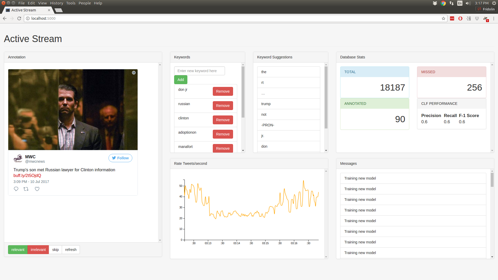

# Active learning support for targeted Twitter stream





## About

The Twitter streaming API allows to track tweets about a specific topic by
tracking user defined keywords. All tweets that contain a keyword can be
accessed (as long as the volume is lower than 1% of total stream). However,
tracking a topic via a keyword has two major disadvantages:

* Keywords allow for crude adjustments of precision / recall tradeoffs. In other
    words in many cases it has poor classification performance
* A researcher / user often does not think of all (or the most useful) keywords
    a priori.

This system is aimed to build a streaming interface that allows the user to
obtain a fine tuned stream that maximizes the number of relevant tweets
from the stream.

Given a set of user selected seed keywords,
an initial stream is produced. The active learning component classifies tweets
as relevant or not and concurrently presents tweets to the user for manual
annotation. Only tweets that the system is most uncertain about are selected for
manual annotation. A second component proposes new keywords based on
co-occurence in the tweet text. 


## Dependencies

* Python 3.6
* Non-standard Python modules: [tweepy](http://www.tweepy.org/), [spaCy](https://spacy.io/) and [gensim](https://radimrehurek.com/gensim/)
* English language model for spaCy (`$ python -m spacy download en`)
* Mongodb (listening on `localhost:27017` which is default setting when
    installing mongodb)

## Run

Put your twitter credentials in a file named `credentials.py` of the 
following format:
```javascript
credentials = {"coll_1": {
        "access_token": "...",
        "access_token_secret": "...",
        "consumer_secret": "...",
        "consumer_key": "...",
    }
}
```

Start the backend with:
```bash
python app.py
```

Monitor status with:
```bash
tail -f debug.log
```

Then open a browser and navigate to:
```bach
localhost:5000
```
